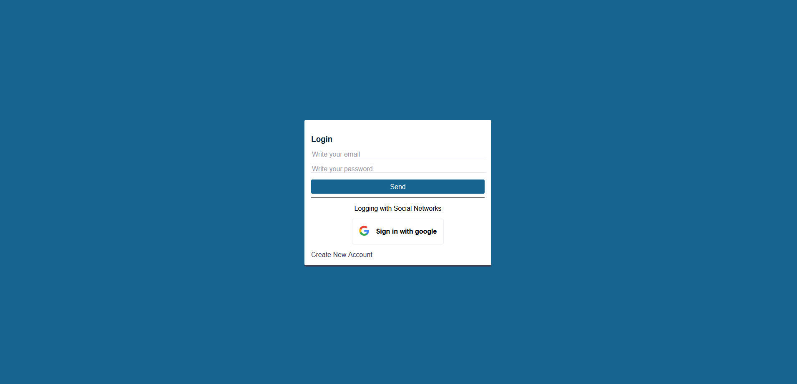
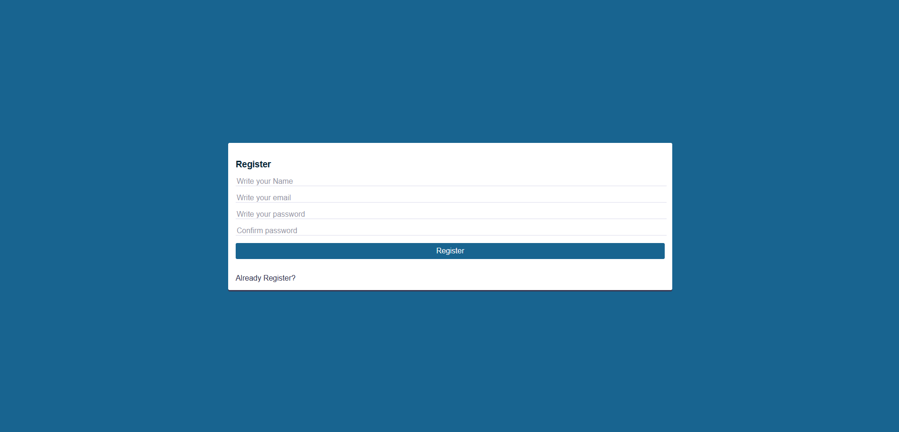
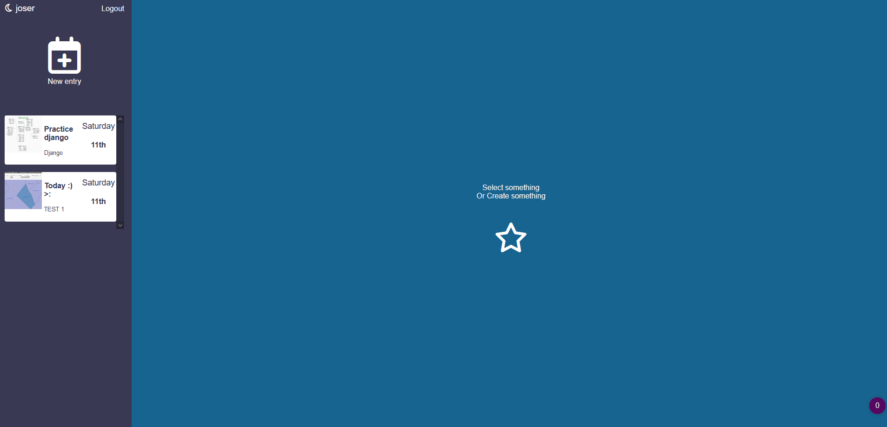
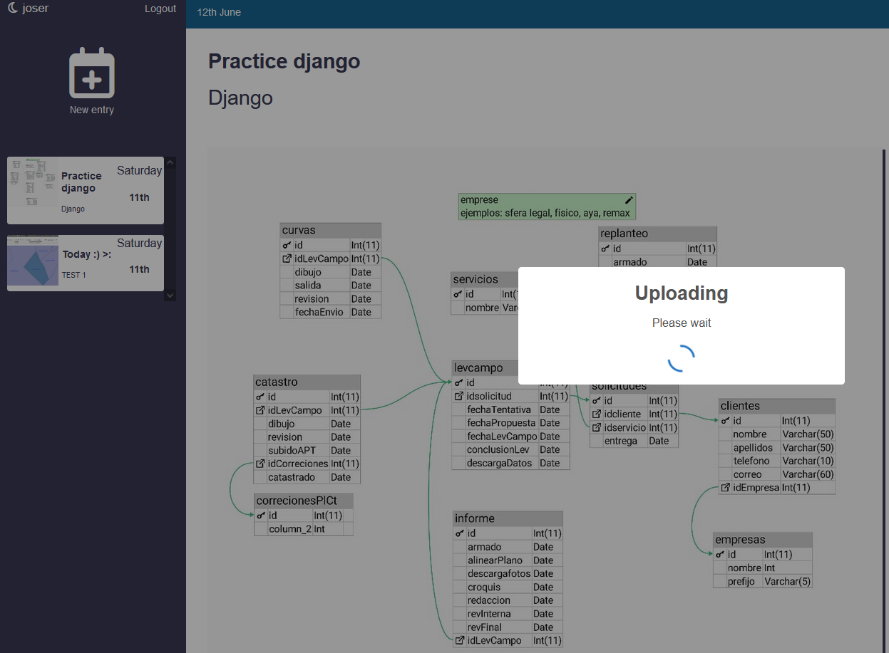
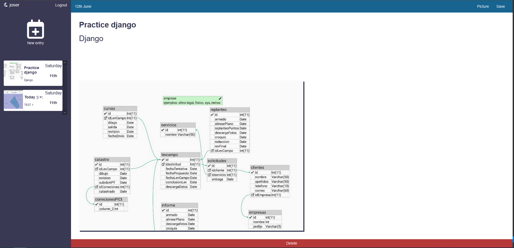

# A journal app
With this app you can save anything about your daily life.

## Used Technologies: **React, SASS, Firebase, SweetAlert2, Moment**

### GitHub Page
https://josebenavidesb.github.io/journal-react-app/

### Login Screen

### Register Screen

### Home Screen

### Load Screen Screen

### Entry Screen

### Run `npm start` to start app

